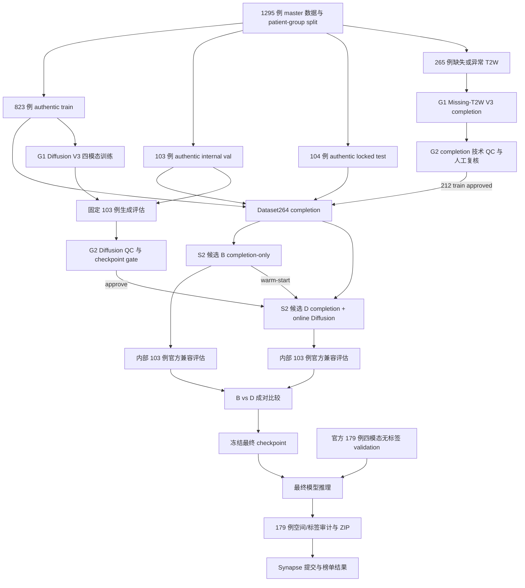

# BraTS 2026 Task 1 最终全流程执行与验收总控手册

> 文档版本：v1.0
> 状态快照：2026-07-20 12:26 CST
> 项目根目录：`/Users/hwaigc/比赛+课题/ECNU_EYU_data`
> 适用范围：G1 缺失 T2W 补全、G1 Diffusion V3、G2 QC、S2 nnU-Net、内部 103 例评估、官方 179 例推理打包和 Synapse 提交
> 文档性质：唯一总控入口。各模块手册仍负责实现细节；发生冲突时，先按本文的冻结数据契约和放行门执行，再回查模块源码。

---

## 1. 文档目的与执行原则

本文把此前分散在 G1、G2、S2、服务器日志和人工复核记录中的信息合并为一条可执行、可追溯、可中断恢复的最终流水线，回答五个问题：

1. 之前已经完成了什么，哪些结果可以直接复用。
2. 当前真正处于什么状态，哪些“完成”只是训练完成而不是正式评估完成。
3. 从当前状态到官方提交还缺哪些步骤、代码入口和质量门。
4. 每一步需要什么输入、输出、算力、验收证据和失败恢复动作。
5. 如何在 Diffusion 在线增强不合格或来不及完成时，安全回退到已经完成的 completion-only S2 模型。

执行时必须遵守以下原则：

- **数据身份优先于模型结果。**任何病例数、split、patient group 或通道顺序不一致时先停，不允许通过改 CSV 绕过。
- **G1 两条产线严格分离。**缺失 T2W V3 是原病例补全；Diffusion V3 是训练期病灶增强，二者不能互相替代。
- **G2 是强制放行门。**技术 QC、人工复核、checkpoint 选择和在线增强 gate 缺一不可。
- **在线 Diffusion 只允许出现在 S2 训练阶段。**内部 validation、locked test、官方 179 例推理均不得在线生成或替换影像。
- **内部 103 例和官方 179 例严格区分。**103 例有真值，可本地运行官方公开评估代码；179 例没有公开真值，只能生成预测并由 Synapse 评分。
- **所有生产结果都要冻结代码、环境、输入和哈希。**当前工作区存在未提交改动，不能只记录旧 Git commit 而忽略实际运行源码。
- **不自动把技术成功等同于比赛收益。**最终选 B 还是 D，必须由同一 103 例上的成对官方兼容指标决定。
- **保留可提交回退。**任何时候 D 线超时、失稳或小病灶指标下降，都回退到已完成的 B 线，不冒险污染最终产物。

---

## 2. 一页结论

### 2.1 当前结论

截至本快照：

- 当前执行目标是在四模态训练收口后 72 小时内完成候选选择、179 例推理和可提交 ZIP；D 线不得占用 B 回退和官方推理的保底时间。

- G1 缺失 T2W 阶段 6 已完成，`265/265` 病例已拉回本机。
- G2 completion 技术 QC 和 47 例重点人工复核已完成，最终为 `212 train + 53 evaluation`，无 pending、rejected 或 regeneration。
- S2 completion-only 候选 B 已完成 200 epoch 微调、`103/103` validation 预测和最终 checkpoint 归档。
- G1 Diffusion V3 中 `t1c/t2w/t2f` 已到 `150000`；`t1n` 在快照时为 `146143/150000`，仍需最终 checkpoint 和完成标记。
- G1 Diffusion checkpoint 的正式 103 例选择、G2 Diffusion QC、S2 completion-online 候选 D、B/D 成对官方兼容评估和官方 179 例推理尚未完成。
- 官方 179 例源数据已在 A800 服务器核验为 `179` 个病例、`716` 个四模态 NIfTI、`0 seg`，但尚未同步到保存 S2 模型的 A100 持久盘。

### 2.2 从现在开始的唯一关键路径

```text
完成并冻结 t1n 150000
  -> 汇总四模态 checkpoint 与 SHA256
  -> 修复生产评估/推理入口的已知阻断点
  -> 对 completion-only 候选 B 跑内部 103 例官方兼容评估
  -> Diffusion 20 例 smoke
  -> Diffusion 固定 103 例 checkpoint 选择
  -> G2 Diffusion 技术 QC + 三平面人工复核
  -> 生成 checkpoint_selection.json + G2 QC gate
  -> 从 B checkpoint warm-start 训练 completion-online 候选 D
  -> B 与 D 在同一 103 例上成对评估
  -> 选择 B 或 D
  -> 官方 179 例推理
  -> 空间/标签/覆盖率审计
  -> 生成根目录 179 个 NIfTI 的 ZIP
  -> 用户确认后上传 Synapse
  -> 保存提交 ID、榜单结果和完整审计包
```

### 2.3 最重要的回退规则

候选 B 已经是可恢复、可评估的完整模型。出现以下任一情况时，不再为 D 延误官方推理：

1. 在线 Diffusion 2 epoch smoke 发生 OOM、NaN/Inf、死锁或几何/通道错误。
2. 根据 smoke 实测外推，D 无法在预留官方推理时间前完成。
3. D 在 103 例上的 small-instance FN 明显增加，或 ET/RC/TC/WT 任一区域出现不可接受退化。
4. G2 Diffusion gate 未批准，或 gate 与 checkpoint selection 哈希不一致。
5. 官方提交窗口只够完成一个模型的 179 例推理。

此时最终候选直接使用 B；Diffusion 线转为赛后研究，不影响本次提交闭环。

---

## 3. 总体框架



### 3.1 五层职责

| 层 | 模块 | 主要职责 | 不负责的内容 |
|---|---|---|---|
| 数据控制层 | G2 manifests/splits | 身份、patient group、split、corrected label、通道契约 | 不训练生成或分割模型 |
| 图像生成层 | G1 completion V3 | 用 `t1n+t1c+t2f` 修复原病例 T2W | 不创建新病例，不做在线增强 |
| 增强生成层 | G1 Diffusion V3 | 从真实 train 的 seg 条件生成四模态病灶区域 | 不替换 validation/official 数据 |
| 质量与发布层 | G2 QC/materializer | 技术 QC、人工复核、release 状态、下游视图 | 不以 SSIM 代替分割收益评估 |
| 分割与提交层 | S2 nnU-Net | 训练、103 例评估、179 例推理与打包 | 不在 validation/inference 调用在线生成 |

### 3.2 当前正式实验命名

| 代号 | 训练数据 | 用途 | 当前状态 |
|---|---|---|---|
| A | 823 real-only | 冻结真实基线，量化 completion 收益 | 已有 checkpoint 和 103 例官方兼容结果 |
| B | 823 real + 212 V3 completion | 当前最低风险提交候选 | 训练完成，尚需同口径官方兼容评估 |
| C | real-only + Diffusion online | 可选研究消融 | 非当前提交关键路径 |
| D | 823 real + 212 completion + Diffusion online | Diffusion 最终候选 | 待 G2 gate 后训练 |

正式报告至少保留 `A vs B` 和 `B vs D`：

- `A vs B` 回答缺失 T2W 补全是否提高分割性能。
- `B vs D` 回答 Diffusion 在线增强是否在 completion 数据基础上继续带来收益。
- 当前硬截止路径不要求重跑 C；只有资源和时间充足时再补充。

### 3.3 模型与软件框架

| 环节 | 框架/模型 | 已冻结的关键配置 |
|---|---|---|
| G1 missing-T2W | VAE + EncDec + BBDM latent ensemble | 输入 `t1n+t1c+t2f`，输出 T2W，原生空间恢复，Stage 6 共 265 例 |
| G1 Diffusion V3 | PyTorch/MONAI 条件 3D Diffusion，`Unet_NnU` | channels `48,96,192,384`，crop `64^3`，EDM，zscore，optimizer steps `150000`，diffusion time steps `1000` |
| G1 推理采样 | EDM Heun | `sampling_steps=18`，checkpoint selection 显式指定四模态 step |
| G2 | Python + nibabel/SimpleITK/scipy/scikit-image | NIfTI、affine、连通域、ROI、边界、z 连续性、人工三平面 QC |
| S2 | `nnUNetv2==2.8.0`，3D full-resolution `PlainConvUNet` | spacing `[1,1,1]`，patch `[128,128,128]`，batch `2`，单卡 fixed split |
| S2 B | `nnUNetTrainerBraTS2026RCCompletionFineTune` | 从 Dataset263 A checkpoint warm-start，200 epochs |
| S2 D | `nnUNetTrainerBraTS2026RCOnlineDiffusion` | 从 B checkpoint warm-start，冻结 G1 四模态生成器，只在 train transform 使用 |
| 内部评估 | `BraTS-evaluation==0.0.8` + `panoptica==2.1.0` | config `mets`，`vol_threshold=27`，`overlap_threshold=0.2` |
| 官方提交 | nnU-Net 179 例 file prediction | 当前仓库产物为根目录 179 个 NIfTI 的 ZIP，不是 Docker 镜像 |

环境必须按项目独立 Conda 管理。禁止 `sudo pip`，禁止把系统/Homebrew Python 与 G1、S2、评估环境混用；服务器环境版本不符时先停止任务，不在生产作业中临时安装。

### 3.4 当前非关键路径

- Stage 5 使用过的冻结 S2 teacher 只保留为 completion 历史风险证据，不再作为最终放行的核心证据；最终由 A/B/D 正式分割消融替代。
- S1、S3、S4、S5 继续作为并行研究线，未经同一 split、同一 103 例官方兼容评估和 179 例推理审计，不进入当前硬截止提交路径。
- B 与 D 不做临时 label union、取最大病灶或简单多数投票。只有实现概率级 ensemble、在同一 103 例通过官方兼容指标且无 small-instance FP 恶化时，才可作为额外候选；这不是当前必须完成项。
- 当前不训练新缺失模态模型，不重跑已经通过 G2 的 265 例 completion。

---

## 4. 冻结数据、标签与坐标契约

### 4.1 病例数量

| 数据层 | train | val | test | 合计 | 说明 |
|---|---:|---:|---:|---:|---|
| master | 1035 | 130 | 130 | 1295 | 全部病例身份口径 |
| real-only | 823 | 103 | 104 | 1030 | T2W 真实且可直接进入 S2 |
| completion | 212 | 27 | 26 | 265 | 缺失/异常 T2W 修复目标 |
| Dataset264 训练 split | 1035 | 103 | 104 | 1242 | 训练只增加 212 train completion；val/test 保持真实 |
| Diffusion source | 823 | 103 | 0 | 926 | 823 训练，103 只做生成质量验证 |
| 官方 validation | 0 | 179 | 0 | 179 | 四模态齐全、无公开 seg，仅供 Synapse 推理提交 |

Dataset264 的 nnU-Net 物化数量必须为：

```text
imagesTr = 4552 = (1035 train + 103 val) x 4
labelsTr = 1138 = 1035 train + 103 val
imagesTs = 416  = 104 locked test x 4
labelsTs = 104
```

`labelsTr=1138` 不表示 1138 例都参与梯度更新；实际训练/验证身份由 fixed split 的 `1035/103` 控制。

### 4.2 唯一身份文件

```text
work_space/G2/results/manifests/nnunet_case_mapping_master.csv
work_space/G2/results/manifests/nnunet_case_mapping_realonly.csv
work_space/G2/results/manifests/g1_v2_source_manifest.csv
work_space/G2/results/splits/splits_master_train_val_test.json
work_space/G2/results/splits/splits_final_train_val_test.json
```

冻结要求：

1. `nnunet_case_mapping_master.csv` 正好 1295 行。
2. `nnunet_case_mapping_realonly.csv` 正好 1030 行。
3. completion 正好 265 行，其中 212/27/26。
4. 同一 `BraTS-MET-xxxxx` patient group 不跨 split。
5. Diffusion 训练 source 只能是 823 个 authentic master-train 病例。
6. official 179 不进入任何训练、checkpoint 选择或 G2 synthetic source。

### 4.3 S2 通道顺序

```text
0000 = t1n
0001 = t1c
0002 = t2w
0003 = t2f
```

### 4.4 标签与官方评估区域

```text
0 = background
1 = NETC
2 = SNFH
3 = ET
4 = RC
```

官方 `mets` 配置评估：

```text
ET = label 3
RC = label 4
TC = labels 1 + 3
WT = labels 1 + 2 + 3
```

预测输出只允许整数标签 `{0,1,2,3,4}`。RC 单独评分，不并入 TC/WT。

### 4.5 G1 与 S2 的轴和通道转换

| 系统 | 通道顺序 | 数组布局 |
|---|---|---|
| G1 Diffusion | `t1c,t1n,t2w,t2f` | NIfTI/内部 `C,X,Y,Z` |
| S2 nnU-Net | `t1n,t1c,t2w,t2f` | batch patch `C,Z,Y,X` |

在线 adapter 必须执行并测试下面的可逆转换：

```text
S2 C,Z,Y,X
  -> 交换 t1n/t1c
  -> transpose 为 G1 C,X,Y,Z
  -> G1 在线增强
  -> transpose 回 S2 C,Z,Y,X
  -> 交换回 t1n/t1c
```

仅测试布局转换函数时，往返转换后的 image/seg 必须逐元素一致，seg 不得被插值。正式在线增强会在选定 generation support 内把借入的合成病灶标签合并进 seg，这是预期行为；但 shape 必须保持不变、support 外的 seg 必须不变、标签值域必须合法。对应实现：

```text
work_space/S2/BraTS2026_S2_RC_v1.0/repository/custom_nnunet/online_diffusion_contract.py
work_space/S2/BraTS2026_S2_RC_v1.0/repository/tests/test_online_diffusion_contract.py
```

### 4.6 病灶大小分层

G2 图像 QC 固定使用：

```text
tiny:  volume < 27 mm3
small: 27 mm3 <= volume <= 275 mm3
large: volume > 275 mm3
```

官方解析器的 small-instance 分支使用 `vol_threshold=27`；G2 的 `small=27..275 mm3` 是额外图像质量分层，不能混写成官方 small-instance 定义。

---

## 5. 当前真实状态仪表盘

### 5.1 总状态

| 流水线项 | 状态 | 当前证据 | 下一动作 |
|---|---|---|---|
| G2 master/real-only split | 已完成 | 1295 master、1030 real-only、patient-group split | 冻结哈希，不重建 |
| G1 missing-T2W Stage 6 | 已完成 | `run_3104668`，265 病例、265 生成 T2W | 不重跑 |
| G2 completion QC | 已完成 | 212 train + 53 evaluation，0 pending/rejected | 直接复用 accepted manifests |
| 47 例人工重点复核 | 已完成 | 47/47 `pass_technical_visual` | 保留报告和 montage |
| S2 A real-only | 已完成 | Dataset263 checkpoint + 103 例官方兼容结果 | 作为 A 基线 |
| S2 B completion-only | 已完成训练 | Epoch 199、103/103 预测、final checkpoint | 补跑官方兼容 103 例评估 |
| Diffusion t1c | 已完成 | `diffusion_150000.pt` | 冻结哈希 |
| Diffusion t2w | 已完成 | `diffusion_150000.pt` | 冻结哈希 |
| Diffusion t2f | 已完成 | `diffusion_150000.pt` | 冻结哈希 |
| Diffusion t1n | 进行中 | 快照 `146143/150000`，loss 有限 | 等 final checkpoint 和完成标记 |
| Diffusion checkpoint selection | 未开始 | 生产评估脚本仍硬检查 100000 | Phase 0 修复后执行 |
| G2 Diffusion QC gate | 未开始 | 无最终 selection/gate JSON | 先 20 例，再 103 例 |
| S2 D completion-online | 未开始 | trainer/adapter 已有，生产 launcher 未闭环 | gate 通过后从 B warm-start |
| B vs D 成对评估 | 未开始 | B 尚缺官方兼容 CSV，D 未训练 | 使用同一 103 例 |
| 官方 179 例推理 | 未开始 | A800 数据完整，A100 尚无副本 | 最终模型冻结后同步并推理 |
| Synapse 提交 | 未开始 | 尚无本轮 179 ZIP | 用户确认后上传 |

### 5.2 G1 completion 归档

本地目录：

```text
work_space/G1/results/missing_t2w_completion/run_3104668
```

已核对：

- 265 个病例目录。
- 265 个生成 T2W。
- 每例五个受控输出：`t1n/t1c/t2w/t2f/seg`。
- 原始 rsync 有效载荷为 2124 文件、17,585,709,944 bytes，源端和本地一致。
- 当前目录额外包含后续生成的 `.rsync_stage6.log` 和 `g2_approval_manifest.csv`，所以当前普通文件总数为 2126；这不是数据重复。
- 本地占用约 16 GB。

重要溯源：原 Stage 5 `FINAL_GATE.json` 曾因固定中心裁切风险给出 `reject_and_retune`。阶段 6 是操作者在确认风险后，通过 `FINAL_GATE_OPERATOR_OVERRIDE_2026-07-17.json` 放行。随后 265 例成品重新经过 G2 技术 QC 和 47 例人工复核并全部通过。最终报告必须同时保留原拒绝、operator override 和后续 G2 放行三段证据，不得改写成“原 Stage 5 自动通过”。

### 5.3 G2 completion 最终状态

```text
case_count                  265
accepted_for_training      212
accepted_for_evaluation     53 = 27 val + 26 locked test
pending_review               0
needs_regeneration           0
rejected                     0
```

47 例重点人工复核：

```text
tiny_ratio_high             44
z_discontinuity              4
两类重叠                      1
去重病例                     47
pass_technical_visual       47
```

这些结论表示技术影像质量可用于受控分割消融，不表示生成 T2W 等同真实 T2W，也不构成临床结论。

### 5.4 S2 completion-only 候选 B

远端模型目录：

```text
/cloud/cloud-ssd1/brats2026/s2/nnUNet_results/
Dataset264_BraTS2026_MET_Completion/
nnUNetTrainerBraTS2026RCCompletionFineTune__nnUNetPlans__3d_fullres/
fold_0/
```

本地轻量归档：

```text
work_space/S2/results/s2_completion_dataset264_t2w_20260720/
```

完成证据：

- 训练到 Epoch 199 后结束。
- `checkpoint_final.pth`：249,830,543 bytes。
- `checkpoint_final.pth` SHA256：`78eccc59f9217a529cafdd522733de9a1578f0e96d8765ee7c48731027824db5`。
- validation 预测：103/103。
- nnU-Net foreground mean Dice：`0.5042405802`。
- label 1/2/3/4 Dice：`0.4668 / 0.7314 / 0.6908 / 0.1279`。

以上是 nnU-Net voxel summary，不是官方 lesionwise DSC/NSD/small-instance 指标。B 在进入最终 B/D 决策前必须补跑 `brats-evaluate --config mets`。

### 5.5 S2 real-only 候选 A

现有 103 例官方兼容归档：

```text
work_space/S2/results/s2_eval_results/
  panoptica_evaluation_summary.json
  leaderboard_metrics.csv
  nnunet_to_source_id.tsv
```

其中 mean 行的关键基线为：

| 区域 | lesionwise DSC | lesionwise NSD | small-instance F1 |
|---|---:|---:|---:|
| ET | 0.6162 | 0.6833 | 0.2875 |
| RC | 0.4235 | 0.3637 | 0.0000 |
| TC | 0.6471 | 0.6956 | 0.3236 |
| WT | 0.6257 | 0.6214 | 0.2770 |

该结果只用于内部成对消融，不是官方 179 例成绩。

### 5.6 服务器与存储

| 角色 | 地址 | GPU/任务 | 关键路径 | 状态 |
|---|---|---|---|---|
| G1 t1c/t2f + official source | `117.50.198.191:23` | A800 x2 | `/root/brats2026/runs/g1_diffusion_v3`、`/root/brats2026/official_validation` | 两模态完成；179 例源完整 |
| G1 t2w + S2 | `117.50.177.229:23` | A100 80GB | `/root/brats2026/runs/g1_diffusion_v3`、`/cloud/cloud-ssd1/brats2026/s2` | t2w 与 B 完成 |
| G1 t1n | `117.50.196.61:23` | H20 | `/root/brats2026/runs/g1_diffusion_v3` | 快照时接近完成 |

不在本文保存密码、token 或私钥。连接参数从本机既有 SSH 配置或受控凭据文件读取。

A100 持久盘当前约 `1.5 TB`，已用约 `146 GB`，可用约 `1.3 TB`，足以容纳 Dataset264、四模态 checkpoint、D 训练结果和 179 例官方数据。正式运行前仍必须重新执行 `df -h`。

---

## 6. 已完成工作的历史梳理

### 6.1 数据与仓库基础

1. 建立 `data_space / work_space / time_pipeline` 三层仓库结构。
2. 建立 G1、G2、S1-S5 独立工作区，医疗影像大文件不进入 Git。
3. 建立 1295 例 master mapping、1030 例 real-only mapping 和 patient-group split。
4. 建立 corrected-label 优先规则和非法标签拒绝规则。
5. 固定 S2 四通道顺序和标签集合。
6. 引入官方 `BraTS_evaluation` 快照并建立独立评估环境方案。

### 6.2 G1 missing-T2W V3

1. 完成 Stage 0 环境/CUDA smoke。
2. 完成数据采用和 fixed split。
3. 完成 VAE fine-tune、统一编码、EncDec/BBDM 训练。
4. 完成固定 103 例 Stage 5 生成、配对 QC、teacher 和人工复核。
5. 发现并记录固定中心裁切导致的视野风险。
6. 通过有记录的 operator override 执行阶段 6，而不是静默修改自动 gate。
7. 完成 265 例生成、rsync 校验和本地归档。

### 6.3 G2 completion

1. 修复外部 raw 路径解析。
2. 修复 `-0.0/0.0` affine signed-zero 假阳性。
3. 验证受保护的 `t1n/t1c/t2f/seg` 未变化。
4. 验证 shape、spacing、affine、标签和 NaN/Inf 全部通过。
5. 生成技术 QC、release manifests、报告和可视化。
6. 对 47 例 tiny/z 风险病例完成三平面人工复核。
7. 通过审批文件重新运行 intake，派生 accepted manifests，未直接手改 accepted CSV。
8. 修复后 G2 共 51 项测试全部通过；Phase 0 仍要求在最终生产源码快照上重新运行，避免把历史测试结果当成当前代码证明。

### 6.4 G1 Diffusion V3

1. 完成 axis contract、crop64、GPU smoke 和真实数据准备。
2. 冻结 823 train + 103 val source，排除 104 locked test 和 265 completion 病例。
3. 修复 optimizer step 与 diffusion time step 混淆：训练目标为 `NUM_STEPS=150000`，扩散时间步保持 `N_STEPS=1000`。
4. 增加每 5000 optimizer step 原子 checkpoint、自动续训和安全 watchdog。
5. 四模态分布在三台云服务器并行训练。
6. t1c/t2w/t2f 已完成 150000；t1n 接近完成。

### 6.5 S2

1. 完成 Dataset263 real-only 当前 fixed split 基线 A 和 103 例官方兼容评估。
2. 完成 Dataset264 completion 数据准备，训练/验证/test 为 `1035/103/104`。
3. 从 Dataset263 checkpoint warm-start 完成候选 B 的 200 epoch 微调。
4. 完成 B 的 103/103 nnU-Net validation 预测和本地结果归档。
5. 实现 completion-online trainer、G1/S2 轴转换、在线 transform 和 split/plan 测试骨架。
6. 实现官方 179 例输入准备、预测空间/标签审计和 ZIP 打包脚本。

---

## 7. Phase 0：生产源码冻结与阻断点修复

这一阶段必须先完成。当前“模型训练完成”不等于“最终入口可执行”。

### 7.1 已知阻断点

| 编号 | 阻断点 | 风险 | 必须修复的结果 |
|---|---|---|---|
| P0-1 | `03_eval_4modal_v3_nyu.slurm` 硬检查 `diffusion_100000.pt` | 100000 已按保留策略清理，评估会直接失败 | 允许显式 selection JSON 或每模态 step，禁止固定 100000 |
| P0-2 | 尚无正式 `checkpoint_selection.json` | 在线 S2 无法证明使用哪四个权重 | 生成带 step、SHA256、配置和评估 run 的冻结文件 |
| P0-3 | 在线 trainer 依赖五个外部路径 | 缺任一变量会在训练开始时报错 | launcher 显式验证全部环境变量 |
| P0-4 | 尚无完整 cloud completion-online launcher | 人工拼命令容易混 dataset、checkpoint 或 gate | 建立单一启动脚本和 preflight |
| P0-5 | `train.sh` 的 online 使用 `Dataset264_BraTS2026_MET_Completion`，`infer.sh` 却要求 `...CompletionOnline` | D 训练成功后推理找不到模型 | 统一 Dataset264 名称，结果以 trainer 名隔离 |
| P0-6 | `infer.sh` 没有 `completion_warmstart` profile | B 无法走通正式 179 推理入口 | 为 B、D 分别加入只读推理 profile |
| P0-7 | 现有 official eval/infer Slurm 只接受 current/legacy | Dataset264 无法复用官方评估与打包入口 | 泛化 wrapper，显式锁定 dataset/trainer/checkpoint |
| P0-8 | official 179 位于 A800，S2 模型位于 A100 | 最终推理缺输入 | 将完整 5.1 GB 数据复制到 A100 持久盘并复核 179/716/0 |
| P0-9 | 工作区有大量未提交改动 | 只记录 Git HEAD 不能复现实验 | 同时保存 HEAD、dirty status、patch 和关键文件哈希 |
| P0-10 | online inference 初始化文件复制不完整 | 新环境可能找不到 OnlineDiffusion trainer | inference preflight 显式安装/导入对应 trainer 组件 |

### 7.2 源码冻结方式

不要为了“干净”而 reset 或覆盖用户改动。生产快照至少保存：

```bash
export PROJECT_ROOT=/absolute/path/to/ECNU_EYU_data
export RUN_AUDIT=/absolute/persistent/path/final_audit/source_$(date +%Y%m%d_%H%M%S)
export GIT_BIN=${GIT_BIN:-git}
mkdir -p "${RUN_AUDIT}"
cd "${PROJECT_ROOT}"

"${GIT_BIN}" rev-parse HEAD > "${RUN_AUDIT}/git_head.txt"
"${GIT_BIN}" status --short --branch > "${RUN_AUDIT}/git_status.txt"
"${GIT_BIN}" diff --binary > "${RUN_AUDIT}/unstaged.patch"
"${GIT_BIN}" diff --cached --binary > "${RUN_AUDIT}/staged.patch"
```

本机执行时先设 `GIT_BIN=/opt/homebrew/bin/git`；服务器使用其项目环境中的 Git。untracked 文件不会进入 Git diff，因此还必须对实际部署的 G1/G2/S2 代码目录生成文件级 SHA256 清单。若生产代码通过 rsync 而不是 Git 部署，以部署目录清单为最终源码证据。

当前本机 HEAD 快照为：

```text
6f72452b4f1fdd3f837ca0419015c92831e565f9
```

该 SHA 不包含当前未提交改动，因此不能单独作为最终源码身份。

### 7.3 Phase 0 最低测试

在对应 Conda 环境中执行，不使用系统 Python，不使用 `sudo pip`：

```bash
# G2
python -m py_compile work_space/G2/code/*.py
python -m unittest discover -s work_space/G2/tests -p 'test_*.py' -v

# S2
python -m unittest discover \
  -s work_space/S2/BraTS2026_S2_RC_v1.0/repository/tests \
  -p 'test_*.py' -v

# shell 静态检查
bash -n work_space/S2/BraTS2026_S2_RC_v1.0/repository/train.sh
bash -n work_space/S2/BraTS2026_S2_RC_v1.0/repository/infer.sh
bash -n 'work_space/G1/code/BraTS_2023_2024_solutions-main 3/Segmentation_Tasks/GliGAN/slurm/03_eval_4modal_v3_nyu.slurm'
```

### 7.4 Phase 0 放行条件

- 所有新增/修改测试通过。
- 评估脚本不再依赖不存在的 100000 checkpoint。
- B 和 D 的 dataset/trainer/result path 各自唯一且推理可解析。
- online preflight 在独立 smoke result root 完成一次模型导入和单 batch 前向。
- 生产源码快照、环境版本和哈希已写入持久盘。
- 179 例源目录仍保持只读，不混入 seg 或训练数据。

---

## 8. Phase 1：完成并冻结四模态 Diffusion checkpoint

### 8.1 最终完成判定

每个模态必须同时满足：

1. `diffusion_150000.pt` 存在且非空。
2. 文件大小合理，当前三个完成模态均约 53.7 MB。
3. 日志包含 `TRAINING_COMPLETE step=150000` 或等价的正常完成标记。
4. 最近 loss 为有限值，无 NaN/Inf/OOM/Traceback。
5. 不因训练 PID 已正常退出而误报失败。

服务器检查模板：

```bash
RUN_ROOT=/root/brats2026/runs/g1_diffusion_v3
LOGDIR=brats2026_diffusion_v3_edm_zscore

for MOD in t1c t1n t2w t2f; do
  CKPT="${RUN_ROOT}/checkpoints/${LOGDIR}/${MOD}/weights/diffusion_150000.pt"
  test -s "${CKPT}"
  sha256sum "${CKPT}"
done
```

四个 checkpoint 分散在三台服务器，必须复制到 A100 持久盘的统一只读目录：

```text
/cloud/cloud-ssd1/brats2026/g1_diffusion_v3_final/
  checkpoints/brats2026_diffusion_v3_edm_zscore/
    t1c/weights/diffusion_150000.pt
    t1n/weights/diffusion_150000.pt
    t2w/weights/diffusion_150000.pt
    t2f/weights/diffusion_150000.pt
  logs/
  checkpoint_inventory.csv
  SHA256SUMS.txt
```

复制使用 `rsync -avP --partial`，完成后对源端和目标端做 SHA256，不允许只看文件大小。

### 8.2 checkpoint 选择策略

1. 先评估四模态全部 `150000` 的组合。
2. 只有 150000 在固定 103 例上出现明确质量退化时，才比较 `145000` 和 `140000`。
3. 不因单个 whole-volume SSIM 更高就跨模态随意挑 step。
4. 最终选择必须固定为一个 JSON，并由 G2 gate 绑定其 SHA256。

建议结构：

```json
{
  "schema_version": 1,
  "run_id": "g1_diffusion_v3_final",
  "checkpoint_steps": {
    "t1c": 150000,
    "t1n": 150000,
    "t2w": 150000,
    "t2f": 150000
  },
  "normalization": "zscore",
  "noise_schedule": "edm",
  "sampling_method": "edm_heun",
  "sampling_steps": 18,
  "source_manifest": "g1_v2_source_manifest.csv",
  "evaluation_split": "fixed_103_val",
  "checkpoint_sha256": {
    "t1c": "...",
    "t1n": "...",
    "t2w": "...",
    "t2f": "..."
  }
}
```

### 8.3 Phase 1 放行条件

- 四个 150000 checkpoint 完整并集中到 A100 持久盘。
- 源/目标 SHA256 一致。
- 四份训练日志归档。
- `checkpoint_inventory.csv` 记录 host、modality、step、size、mtime、SHA256。
- 原服务器上的 checkpoint 不删除，至少保留到 Synapse 成绩确认。

---

## 9. Phase 2：候选 B 的内部 103 例正式评估

### 9.1 为什么必须补做

候选 B 已有 nnU-Net `summary.json`，但该文件只给 voxel-level label Dice。最终比较要求的是官方 Task 1 风格的：

- ET/RC/TC/WT lesionwise DSC。
- ET/RC/TC/WT lesionwise NSD。
- small-instance TP/FN/FP/F1。

因此不能直接用 `foreground_mean Dice=0.5042` 与 A 的 `leaderboard_metrics.csv` 比较。

### 9.2 输入

```text
prediction:
/cloud/cloud-ssd1/brats2026/s2/nnUNet_results/
Dataset264_BraTS2026_MET_Completion/
nnUNetTrainerBraTS2026RCCompletionFineTune__nnUNetPlans__3d_fullres/
fold_0/validation/*.nii.gz

reference:
/cloud/cloud-ssd1/brats2026/s2/nnUNet_preprocessed/
Dataset264_BraTS2026_MET_Completion/gt_segmentations/*.nii.gz

mapping/split:
/cloud/cloud-ssd1/brats2026/s2/.../data/splits/completion_warmstart/
```

预测和 reference 必须先从 nnU-Net ID 映射回同一 `source_case_id`；不能依赖目录排序配对。

### 9.3 官方兼容命令

在独立 `brats_eval` Conda 环境中：

```bash
brats-evaluate \
  --config mets \
  --ref_path /path/to/B_source_id_reference \
  --pred_path /path/to/B_source_id_prediction \
  --summary_json /path/to/B/panoptica_evaluation_summary.json

brats-parse-metrics mets \
  --json_path /path/to/B/panoptica_evaluation_summary.json \
  --vol_threshold 27 \
  --overlap_threshold 0.2 \
  --output_csv_path /path/to/B/leaderboard_metrics.csv
```

输出建议归档到：

```text
work_space/S2/results/s2_completion_dataset264_t2w_20260720/official_style_eval/
```

### 9.4 Phase 2 放行条件

- prediction、reference、mapping 都是同一 103 个唯一病例。
- evaluator `missings=[]`。
- 输出 CSV 有 103 个病例行和 mean/std/median 汇总行。
- 命令参数明确记录为 `mets / 27 / 0.2`。
- 结果目录保存 checkpoint SHA256、评估包版本和 source-ID 映射。

---

## 10. Phase 3：Diffusion 生成评估与 checkpoint 选择

### 10.1 先做 20 例 smoke

从固定 103 例 val 中选择 20 例，选择清单必须在生成前冻结。建议构成：

- 至少 8 例含 RC，其中优先覆盖 tiny RC。
- 至少 8 例含 tiny/small lesion，可与 RC 重叠。
- 覆盖低、中、高病灶负荷和多个 patient group。
- 覆盖上一轮数据审计中容易出现边界、空洞或 z 连续性问题的病例。
- 保留 4 例普通中位病例，避免只在极端病例上判断。

smoke 只回答四件事：

1. 四模态 checkpoint 能否加载。
2. 轴、通道、normalization 和 sampling 配置是否正确。
3. 输出是否可由 G2 读取并生成完整 paired panel。
4. 单例耗时和显存是否允许跑完整 103 例及在线训练。

Phase 0 修复 checkpoint 选择入口后，150k checkpoint 保真层的命令骨架为：

```bash
export G1_CODE='/root/brats2026/gligan'
export RUN_ROOT='/cloud/cloud-ssd1/brats2026/g1_diffusion_v3_final'
export CKPT_DIR="${RUN_ROOT}/checkpoints/brats2026_diffusion_v3_edm_zscore"
export CSV_PATH="${RUN_ROOT}/splits/val_smoke20.csv"
export OUTPUT_DIR="${RUN_ROOT}/eval/150000_smoke20"

cd "${G1_CODE}"
python src/infer/evaluate_generation.py \
  --diffusion_ckpt_dir "${CKPT_DIR}" \
  --csv_path "${CSV_PATH}" \
  --dataset BRATS_2024 \
  --output_dir "${OUTPUT_DIR}" \
  --generator_type Unet_NnU \
  --crop_size 64 \
  --normalization zscore \
  --sigma_data 1.0 \
  --evaluation_mode whole_brain \
  --large_lesion_mode tile \
  --split val \
  --noise_schedule edm \
  --sampling_method edm_heun \
  --sampling_steps 18 \
  --max_cases 0
```

`val_smoke20.csv` 必须只含预先冻结的 20 例，不能用原 CSV 的“前 20 行”代替分层抽样。完整 103 例只替换为 fixed-val CSV 和新的 output dir。若比较 145k/140k，必须由修复后的 selection 入口显式加载对应 step；不能通过删除 150k 让“自动选最大 checkpoint”间接切换。

### 10.2 103 例配对图像指标

Diffusion 放行需要两层互补证据：

1. **checkpoint 保真层：**在固定 103 例 authentic validation 上，以病例自身 seg 为条件生成，并与真实四模态做 paired 指标和三平面比较。这一层用于选择 checkpoint。
2. **online 路径一致性层：**调用与 S2 D 完全相同的 `OnTheFlyTumourAugmenter`，在冻结 seed 的训练式 patch 上执行借入病灶、插入、四模态 inpainting 和 seg 合并。这一层没有逐体素真实 target，主要检查 support、边界、标签、几何、速度和确定性回放。

不能只验证 `evaluate_generation.py` 后就默认在线 transform 正确；也不能只看在线 patch 而省略 103 例有真实 target 的 checkpoint 保真评估。

每个模态至少输出：

| 范围 | 指标 |
|---|---|
| whole volume | SSIM、PSNR、MAE |
| brain mask | SSIM、PSNR、MAE |
| tumor ROI `seg>0` | SSIM、PSNR、MAE |
| NETC | SSIM、PSNR、MAE、对比度差 |
| SNFH | SSIM、PSNR、MAE、对比度差 |
| ET | SSIM、PSNR、MAE、对比度差 |
| RC | SSIM、PSNR、MAE、对比度差 |
| connected lesion | 体积、size class、ROI error、边界误差 |

whole-volume SSIM 只能作为辅助项；大面积零背景会抬高分数，不能用于单独放行。

### 10.3 伪影与结构指标

每例记录：

- 病灶内外对比度及其绝对误差。
- lesion blur ratio。
- 空洞/brain void/lesion void。
- ghosting 或重复结构。
- generation support 边界梯度不连续。
- z 方向面积和强度连续性。
- 脑外信号比例。
- 非生成区域是否发生变化。
- tiny/small/large 连通病灶分布。

online 路径一致性层额外要求：

- 固定 seed 能重放同一选择和插入结果。
- `was_modified=False` 时 image 和 seg 均逐元素不变。
- `was_modified=True` 时，seg 只在记录的插入 support 内变化。
- support 外四模态保持不变或满足实现中明确记录的边界过渡容差。
- 插入后的 in-memory seg 只允许 `{-1,0,1,2,3,4}`，其中 `-1` 仅代表 nnU-Net patch padding；导出 NIfTI 不允许 `-1`。
- 新增病灶的四模态位置与新增 seg 完全对齐。

### 10.4 三平面可视化

每例、每个重点模态至少展示：

```text
真实影像 | 生成影像 | 绝对误差 | 生成影像 + seg overlay
```

同时检查轴位、冠状位、矢状位。人工复核顺序固定为：

1. tumor ROI SSIM 最低病例。
2. RC 病例。
3. tiny/small lesion 病例。
4. 自动伪影告警病例。
5. 随机抽取中位分病例。
6. 随机抽取高分病例，排除指标被背景抬高。

### 10.5 比较 150k、145k、140k

- 默认只跑 150k 全 103 例。
- 若 150k 失败，先确认是否是脚本、轴、checkpoint metadata 或 sampling 配置错误。
- 只有排除实现错误后，才在同一 20 例或同一 103 例上比较 145k/140k。
- 每个候选使用相同 seed、sampling method、sampling steps、病例集和指标代码。
- 禁止按不同病例为不同模态挑 checkpoint。

### 10.6 Phase 3 放行条件

- 20 例 smoke 无硬失败。
- 103 例四模态生成完整，ID 无缺失/重复。
- 指标、可视化和运行 metadata 齐全。
- checkpoint 选择在看 S2 D 结果前冻结，防止按下游结果反向挑权重。
- 生成 `checkpoint_selection.json` 并计算 SHA256。

---

## 11. Phase 4：G2 Diffusion 技术 QC 与人工放行

### 11.1 技术硬门

任一失败直接拒绝本轮 Diffusion，不启动 D：

1. generation config、seed、source manifest、checkpoint selection 或日志缺失。
2. source 不属于 823 train 或固定 103 val。
3. 读取了 104 locked test、265 completion-only evaluation 或官方 179。
4. NIfTI/数组不可读、常数、NaN/Inf。
5. shape、spacing、affine、orientation 或轴转换不一致。
6. checkpoint 保真层的输入 seg 被改动，或 online 层在声明 support 外改动 seg。
7. online patch 标签超出 `{-1,0,1,2,3,4}`，或导出 NIfTI 标签超出 `{0,1,2,3,4}`。
8. 非 generation support 区域被意外修改。
9. 输出出现空白视野、裁切、块状空洞、明显重影或边界断裂。
10. checkpoint selection 的文件哈希与实际加载权重不一致。

### 11.2 人工技术复核

完整 103 例至少自动生成 review index；人工必须复核：

- 全部高风险病例。
- 全部 RC 严重异常病例。
- 全部 tiny lesion 严重异常病例。
- 所有 z discontinuity、void、ghosting、boundary 告警。
- 每个分数层随机病例。

人工结论使用：

```text
pass_technical_visual
pass_with_documented_risk
needs_regeneration
reject
```

`pass_with_documented_risk` 不能自动变成 approve，必须由总负责人决定。

### 11.3 G2 gate 文件

在线 trainer 当前强制读取：

```text
G1_DIFFUSION_CODE_DIR
G1_DIFFUSION_CHECKPOINT_DIR
G1_DIFFUSION_CHECKPOINT_SELECTION
G1_DIFFUSION_LABEL_POOL
G2_DIFFUSION_QC_GATE
```

gate 至少包含：

```json
{
  "decision": "approve",
  "checkpoint_selection_sha256": "...",
  "normalization": "zscore",
  "sampling_method": "edm_heun",
  "sampling_steps": 18,
  "case_count": 103,
  "reviewed_case_count": 103,
  "hard_failure_count": 0,
  "report": "..."
}
```

label pool 必须恰好 823 行，每行是一个存在的 train seg 绝对路径。online trainer 会拒绝不是 823 行的文件。

### 11.4 Phase 4 放行条件

- 技术硬门全部通过。
- 人工重点病例完成复核。
- `decision=approve`。
- gate 的 `checkpoint_selection_sha256` 与实际 selection 文件一致。
- normalization 固定 `zscore`，sampling 固定 `edm_heun`，steps 与 QC 时完全相同。
- gate、selection、label pool 和报告复制到 A100 持久盘只读目录。

---

## 12. Phase 5：S2 completion-online 候选 D

### 12.1 训练语义

D 使用和 B 相同的 Dataset264：

```text
train      1035 = 823 real + 212 completion
val         103 = authentic only
locked test 104 = authentic only
```

区别只在训练 transform：按固定概率对 train patch 调用冻结的四模态 Diffusion。validation、test 和 official inference 不调用 Diffusion。

### 12.2 初始化

D 必须从 B 的 final checkpoint warm-start，而不是从头训练，也不是回到 A：

```text
/cloud/cloud-ssd1/brats2026/s2/nnUNet_results/
Dataset264_BraTS2026_MET_Completion/
nnUNetTrainerBraTS2026RCCompletionFineTune__nnUNetPlans__3d_fullres/
fold_0/checkpoint_final.pth
```

trainer：

```text
nnUNetTrainerBraTS2026RCOnlineDiffusion
```

### 12.3 固定参数

当前代码默认：

```text
S2_ONLINE_EPOCHS=200
S2_ONLINE_INITIAL_LR=0.001
S2_ONLINE_SAVE_EVERY=25
S2_ONLINE_AUGMENT_PROB=0.6
S2_ONLINE_SECOND_TUMOUR_PROB=0.4
S2_ONLINE_MAX_TUMOURS=2
sampling_method=edm_heun
sampling_steps=18
single S2 GPU
```

这些参数必须在正式 D 启动前冻结。不能在看到 validation 指标后无记录地修改增强概率或 sampling steps。

### 12.4 独立 smoke

正式结果目录之外先运行 2 epoch smoke：

```text
nnUNet_results_smoke/
```

smoke 必须验证：

1. B pretrained checkpoint 成功加载。
2. 四个 Diffusion checkpoint 成功加载。
3. `ONLINE_DIFFUSION_STATS` 持续输出。
4. `calls` 增长，`modified/calls` 与目标概率大致一致。
5. loss 有限，无 OOM、NaN/Inf、dataloader deadlock。
6. G1/S2 纯轴转换往返逐元素一致；实际增强后 shape 不变、标签值域合法，所有 image/seg 变化都受 generation support 约束。
7. 实测每 epoch 时间，用于外推 200 epoch 总时长。

smoke 目录不得作为正式 D 续训目录，避免 2 epoch 的 final checkpoint 干扰正式完成判断。

### 12.5 正式运行环境变量模板

```bash
export S2_EXPERIMENT_MODE=completion_online
export S2_PRETRAINED_WEIGHTS=/cloud/cloud-ssd1/brats2026/s2/nnUNet_results/Dataset264_BraTS2026_MET_Completion/nnUNetTrainerBraTS2026RCCompletionFineTune__nnUNetPlans__3d_fullres/fold_0/checkpoint_final.pth

export G1_DIFFUSION_CODE_DIR='/root/brats2026/gligan'
export G1_DIFFUSION_CHECKPOINT_DIR='/cloud/cloud-ssd1/brats2026/g1_diffusion_v3_final/checkpoints/brats2026_diffusion_v3_edm_zscore'
export G1_DIFFUSION_CHECKPOINT_SELECTION='/cloud/cloud-ssd1/brats2026/g1_diffusion_v3_final/gates/checkpoint_selection.json'
export G1_DIFFUSION_LABEL_POOL='/cloud/cloud-ssd1/brats2026/g1_diffusion_v3_final/gates/train_823_labels.txt'
export G2_DIFFUSION_QC_GATE='/cloud/cloud-ssd1/brats2026/g1_diffusion_v3_final/gates/g2_diffusion_qc_gate.json'

export S2_ONLINE_EPOCHS=200
export S2_ONLINE_INITIAL_LR=0.001
export S2_ONLINE_SAVE_EVERY=25
export S2_ONLINE_AUGMENT_PROB=0.6
export S2_ONLINE_SECOND_TUMOUR_PROB=0.4
export S2_ONLINE_MAX_TUMOURS=2
```

`G1_DIFFUSION_CODE_DIR` 的最终值必须指向服务器实际 GliGAN 代码目录；上面路径仅为目标部署布局，不得在目录不存在时照抄运行。

A100 当前实际 S2 数据路径应显式设置，避免 `train.sh` 回退到代码仓库内的小目录：

```bash
export S2_REPO='/root/brats2026/ECNU_EYU_data/work_space/S2/BraTS2026_S2_RC_v1.0/repository'
export nnUNet_raw='/cloud/cloud-ssd1/brats2026/s2/nnUNet_raw'
export nnUNet_preprocessed='/cloud/cloud-ssd1/brats2026/s2/nnUNet_preprocessed'
export nnUNet_results='/cloud/cloud-ssd1/brats2026/s2/nnUNet_results'
export BRATS_SPLIT_DIR='/cloud/cloud-ssd1/brats2026/s2/splits/completion_warmstart'

test "$(wc -l < "${BRATS_SPLIT_DIR}/train_fixed.txt" | tr -d ' ')" = 1035
test "$(wc -l < "${BRATS_SPLIT_DIR}/val_fixed.txt" | tr -d ' ')" = 103

cd "${S2_REPO}"
bash train.sh
```

online 与 B 使用完全相同的 `1035/103` split。可以继续指向已审计的 `completion_warmstart` split，也可以复制到独立的 `completion_online` 目录，但复制后两套文件 SHA256 必须一致。不能让 `train.sh` 使用一个不存在或重新随机生成的 online split。

2 epoch smoke 将 `nnUNet_results` 指向独立路径，例如：

```text
/cloud/cloud-ssd1/brats2026/s2/nnUNet_results_smoke_online
```

正式训练前必须恢复生产 `nnUNet_results`，并确认 OnlineDiffusion trainer 的正式 fold 目录为空或来源明确；不删除 B 的 CompletionFineTune 目录。

### 12.6 资源

推荐：

```text
GPU       1 x A100 80GB
CPU       16
RAM       96-128 GB
storage   A100 持久盘
```

在线 Diffusion 与 nnU-Net 共用一张 GPU，不能依靠增加 `-num_gpus 2` 自动提速。保持单进程，先用 smoke 实测。

### 12.7 监控

每 15-30 分钟检查：

- trainer 进程、epoch、train/val loss。
- `ONLINE_DIFFUSION_STATS calls/modified/mean_seconds`。
- GPU 显存、利用率、温度。
- checkpoint 每 25 epoch 更新。
- 磁盘剩余空间。
- OOM、NaN/Inf、Traceback、worker deadlock。

### 12.8 截止时间控制

- 2 epoch smoke 完成后立即外推 200 epoch 时间。
- 若外推不能在“官方推理预留窗口”前完成，不修改已 QC 的 sampling 配置硬跑，直接回退 B。
- 正式 D 至少保留 25/50/75/100/125/150/175/final checkpoint。
- 若发生可恢复中断，从 `checkpoint_latest.pth` 续训；禁止覆盖 B 结果目录。

### 12.9 Phase 5 放行条件

- final checkpoint 存在。
- 训练日志无 NaN/Inf/OOM。
- 103 个 validation prediction 完整。
- validation 阶段没有调用在线 Diffusion。
- checkpoint、selection、gate、代码和参数哈希写入归档。

---

## 13. Phase 6：B 与 D 的成对官方兼容评估

### 13.1 固定输入

B 和 D 必须共享：

- 同一 103 例 source ID。
- 同一 reference NIfTI。
- 同一 `brats_evaluation` 和 `panoptica` 版本。
- 同一 `mets` 配置。
- 同一 `vol_threshold=27`。
- 同一 `overlap_threshold=0.2`。

### 13.2 输出字段

每个模型都输出：

```text
panoptica_evaluation_summary.json
leaderboard_metrics.csv
evaluation_environment.txt
checkpoint_sha256.txt
source_id_mapping.tsv
```

比较表至少包含：

| 指标族 | 区域 |
|---|---|
| lesionwise DSC mean/std/median | ET、RC、TC、WT |
| lesionwise NSD mean/std/median | ET、RC、TC、WT |
| all-instance TP/FP/FN/F1 | ET、RC、TC、WT |
| small-instance TP/FP/FN/F1 | ET、RC、TC、WT |
| per-case paired delta | 103 例 |

建议同时做按病例 bootstrap 95% CI，但不能用 bootstrap 代替原始病例级表。

### 13.3 最终选择规则

先执行硬否决，再比较收益：

**D 硬否决条件：**

1. 任一区域 small-instance FN 明显增加且 F1 下降。
2. small-instance FP 增加超过 10%，但 TP 没有增加。
3. RC 指标出现明确退化，尤其 RC small-instance F1/FN。
4. lesionwise DSC 或 NSD 的下降由少数严重失败病例驱动。
5. 预测覆盖、标签或空间审计不完整。

**无硬否决时：**

- D 在 lesionwise DSC、lesionwise NSD、small-instance F1 三个指标族中至少两个整体改善，选择 D。
- B/D 差异不确定或互有得失时，优先选择更稳定、流程更简单的 B。
- 不允许只凭 whole-volume Dice、训练 loss 或视觉效果选择 D。

最终决策写入：

```text
work_space/S2/results/final_model_selection_20260720/
  FINAL_MODEL_DECISION.md
  paired_metrics.csv
  per_case_delta.csv
  model_B_manifest.json
  model_D_manifest.json
```

### 13.4 Phase 6 放行条件

- B/D 都有 103 例官方兼容结果。
- 病例集合和 reference 哈希完全一致。
- 决策依据含小病灶和 RC，不只含平均 Dice。
- 最终 checkpoint 路径和 SHA256 唯一。
- 决策文件由负责人确认后锁定，不在官方 179 推理中再次选模型。

---

## 14. Phase 7：官方 179 例推理与 ZIP

### 14.1 官方数据事实

当前 A800 源：

```text
/root/brats2026/official_validation
```

已实时核验：

```text
case directories = 179
t1n = 179
t1c = 179
t2w = 179
t2f = 179
seg = 0
size ~= 5.1 GB
```

这 179 例四模态齐全，不需要 G1 completion，也不得进入 G2 synthetic QC 或训练。

### 14.2 同步到 A100

目标建议：

```text
/cloud/cloud-ssd1/brats2026/official_validation
```

传输完成后核对：

```bash
VALIDATION_ROOT=/cloud/cloud-ssd1/brats2026/official_validation

find "${VALIDATION_ROOT}" -mindepth 1 -maxdepth 1 -type d -name 'BraTS-MET-*' | wc -l
for MOD in t1n t1c t2w t2f seg; do
  printf '%s=' "${MOD}"
  find "${VALIDATION_ROOT}" -type f -name "*-${MOD}.nii.gz" | wc -l
done
```

必须得到：

```text
179 / 179 / 179 / 179 / 179 / 0
```

对 179 个病例 ID 列表生成 SHA256；若走中转传输，源端和目标端都计算同一清单。

云硬盘不是三台实例自动共享的文件系统。优先在两台服务器之间使用已授权的 `rsync -avP --partial`；若云主机间没有互信 SSH，则由本机作为两段式中转。任何方式都不能在命令或日志中写入明文密码，且传输完成后必须做文件清单和哈希复核。

### 14.3 推理 profile

Phase 0 修复后，推理入口必须支持：

```text
completion_warmstart -> 候选 B trainer/checkpoint
completion_online    -> 候选 D trainer/checkpoint
```

推理过程中：

- 不加载或调用 G1 Diffusion transform。
- 不进行 test-time 训练。
- 不修改官方四模态数据。
- 只使用 Phase 6 冻结的一个 checkpoint。
- `fold_0` 只是固定模型 API key，不代表五折 ensemble。

### 14.4 输入展平

每例转为：

```text
BraTS-MET-xxxxx-xxx_0000.nii.gz  # t1n
BraTS-MET-xxxxx-xxx_0001.nii.gz  # t1c
BraTS-MET-xxxxx-xxx_0002.nii.gz  # t2w
BraTS-MET-xxxxx-xxx_0003.nii.gz  # t2f
```

输入必须恰好 716 个 NIfTI，不允许旧文件残留。

### 14.5 推理资源

```text
GPU       1 x A100 80GB
CPU       8-16
RAM       64 GB
walltime  24 h 上限
```

nnU-Net 当前入口不会因申请两张 GPU 自动加速，因此只申请一张。

### 14.6 输出审计

预测目录必须：

1. 恰好 179 个 `.nii.gz`。
2. 文件名恰好为 `BraTS-MET-xxxxx-xxx.nii.gz`。
3. 每个输入 ID 恰好一个输出，无 missing/unexpected。
4. 标签为整数且只在 `{0,1,2,3,4}`。
5. dimensions、spacing、origin、orientation、affine 与对应官方源一致。
6. 记录空预测病例，但空预测本身不通过手工填标签修复。

使用：

```text
work_space/S2/BraTS2026_S2_RC_v1.0/repository/scripts/07_package_official_submission.py
```

### 14.7 ZIP 契约

ZIP 必须只包含 179 个 NIfTI，且全部位于压缩包根目录：

```bash
unzip -t /path/to/submission.zip
test "$(unzip -Z1 /path/to/submission.zip | wc -l | tr -d ' ')" = 179
test "$(unzip -Z1 /path/to/submission.zip | grep -c '/')" = 0
sha256sum /path/to/submission.zip
```

只上传 ZIP，不把内部 103 例 prediction、CSV、JSON、checkpoint 或 manifest 放进 ZIP。

### 14.8 本地不能做什么

官方 179 例没有公开 seg，因此：

- 不能在本地运行 `brats-evaluate` 得到官方 179 分数。
- 不能用内部 103 例 reference 冒充官方 reference。
- 不能声称 ZIP 通过本地指标即等于官方成绩。
- 官方 DSC/NSD/F1 只以 Synapse scorer 返回为准。

---

## 15. Phase 8：Synapse 提交与归档

### 15.1 提交前检查

1. 当前浏览器账号仍已登录正确的 Synapse 团队/个人身份。
2. 页面仍是 BraTS 2026 Task 1 对应 submission queue。
3. 当前 queue 接受 file prediction ZIP；若页面改为 Docker/container，立即停止，不把 ZIP 提交到错误队列。
4. 核对 submission quota、截止时间和是否为 provisional/final。
5. 用户明确确认本次是刷榜提交还是最终提交。

当前仓库实现的是 179 例 NIfTI ZIP file-prediction 路线，不包含 Docker 构建链。除非 Synapse 当前页面明确要求容器，否则不临时改成 Docker。

### 15.2 上传内容

只上传：

```text
<final_model>_Task1_validation_179.zip
```

不上传：

- `leaderboard_metrics.csv`。
- `panoptica_evaluation_summary.json`。
- 103 例 prediction/reference。
- checkpoint。
- manifest 或 QC 报告。

### 15.3 刷榜与最终提交

- **刷榜提交：**用于获得官方 179 分数，记录 submission ID 和返回结果，不自动标记为最终。
- **最终提交：**只有用户明确确认后执行，先比较所有有效刷榜结果，再选择最终条目。
- 若配额允许，可先提交 B 获取稳定基准，再提交通过 Phase 6 的 D；若配额紧张，优先提交 Phase 6 选出的唯一模型。

### 15.4 提交后归档

```text
work_space/S2/results/submissions/<submission_id>/
  submitted.zip
  zip_sha256.txt
  official_submission_validation.json
  official_submission_manifest.csv
  final_model_manifest.json
  source_snapshot/
  environment_freeze.txt
  synapse_submission_record.md
  leaderboard_result.json-or-screenshot
```

`synapse_submission_record.md` 至少写：

```text
submission_id
submitted_at
queue/task
provisional_or_final
model=B_or_D
checkpoint_sha256
zip_sha256
official returned metrics
operator
notes
```

---

## 16. 各阶段输入、输出和 Gate 总表

| Phase | 输入 | 核心输出 | 放行门 |
|---|---|---|---|
| 0 | 当前源码和脚本 | 可运行的 eval/train/infer profiles、源码快照 | 测试通过，路径一致 |
| 1 | 四台/三台服务器 checkpoint | 统一四模态 checkpoint 目录、SHA256 | 四模态 150000 完整 |
| 2 | B 的 103 predictions + GT | B 官方兼容 JSON/CSV | 103/103、missings=[] |
| 3 | 四模态 checkpoint + 103 val | paired metrics、montage、selection JSON | smoke 和 full eval 通过 |
| 4 | Phase 3 结果 | G2 gate、823 label pool | decision=approve，哈希绑定 |
| 5 | Dataset264 + B checkpoint + gate | D final checkpoint + 103 predictions | 训练稳定、validation 无 online augmentation |
| 6 | B/D predictions + 同一 GT | paired comparison、FINAL_MODEL_DECISION | 小病灶/RC 无硬否决 |
| 7 | 最终 checkpoint + official 179 | 179 predictions + audited ZIP | 179、标签、空间、ZIP 全通过 |
| 8 | audited ZIP | Synapse submission ID 和成绩 | 用户确认、正确 queue |

---

## 17. 关键路径与并行安排

### 17.1 可并行任务

在 t1n 最后训练期间可并行：

- 修复 Phase 0 的 eval/infer profile。
- 对 B 运行 103 例官方兼容评估。
- 将官方 179 从 A800 同步到 A100 持久盘。
- 准备 Diffusion 20 例 stratified list。
- 生成 823 label pool 并做路径审计。
- 冻结源码和环境清单。

### 17.2 必须串行的依赖

```text
t1n 150000
  -> 四模态 checkpoint 汇总
  -> Diffusion 103 eval
  -> G2 gate
  -> D smoke
  -> D formal training
  -> D 103 eval
  -> B/D decision
  -> final 179 inference
  -> package
  -> Synapse
```

### 17.3 资源分配

| 设备 | 当前/后续任务 | 原则 |
|---|---|---|
| H20 | 完成 t1n | 完成前不抢占 |
| A800 GPU 0/1 | checkpoint 整理、Diffusion 103 eval、官方源端 | 生成评估和数据源可并行安排 |
| A100 80GB | B 评估、D smoke/训练、最终 179 推理 | 最终 S2 主机和持久产物主机 |
| CPU/本机 | G2 QC、报告、哈希、CSV 对比 | 不把大 NIfTI 提交 Git |

---

## 18. 时间预算与截止策略

下面是从“四模态 150000 全部完成”开始的 72 小时相对预算。实际以 smoke 实测为准，不把估算写成承诺。

| 时间段 | 任务 | 目标 |
|---|---|---|
| T+0 至 T+2h | Phase 0 收口、checkpoint 汇总、B 评估启动 | 所有入口可跑 |
| T+2 至 T+8h | Diffusion 20 例和 103 例评估、G2 自动 QC | selection 候选产生 |
| T+8 至 T+12h | 人工复核、G2 gate、D 2 epoch smoke | 确认 D 是否值得继续 |
| T+12 至 T+36h | D 正式训练 | 以 smoke 外推为准 |
| T+36 至 T+42h | D validation、B/D 官方兼容评估 | 冻结最终模型 |
| T+42 至 T+50h | 官方 179 推理、审计和打包 | 生成可上传 ZIP |
| T+50 至 T+60h | Synapse 上传、队列等待和异常缓冲 | 留足修复时间 |

硬截止策略：

- 到 T+12h，D smoke 若未通过，立即选择 B。
- 到 T+30h，D 若仍无法给出可信完成时间，停止把它作为本次提交依赖。
- 官方推理和打包至少保留 10 小时独占窗口。
- 不把 Synapse 上传安排在截止前最后一小时。

---

## 19. 停止条件与恢复手册

### 19.1 Diffusion 训练/评估

| 异常 | 立即动作 | 恢复条件 |
|---|---|---|
| PID 退出但无 final checkpoint | 查日志最后 step 和信号处理 | 从最大原子 checkpoint 续训 |
| NaN/Inf | 停止该模态/评估 | 定位数据、AMP、checkpoint 后重新 smoke |
| 100000 缺失 | 不复制或伪造旧 checkpoint | 修复脚本读取 selection/150000 |
| checkpoint 哈希不一致 | 停止 G2/D | 重新 rsync 并逐端校验 |
| 轴/通道错误 | 拒绝整轮输出 | 修复 contract 后重跑 smoke |

### 19.2 G2 QC

| 异常 | 处理 |
|---|---|
| source/split 不一致 | 停止，回到 master mapping |
| signed zero affine | 使用已修复的数值等价比较，不手改 NIfTI |
| 空洞/裁切/重影 | `needs_regeneration` 或 reject，不用全局 override 清除 |
| tiny/z soft flag | 生成三平面和相邻层面板后逐例人工结论 |
| accepted CSV 需变更 | 修改 approval manifest 后重跑 intake，不直接编辑 accepted CSV |

### 19.3 S2 D

| 异常 | 处理 |
|---|---|
| OOM | 停止 formal run；在 smoke 中调低 batch/并发并重新冻结参数 |
| dataloader deadlock | 保持 single-threaded online transform，检查 worker 设置 |
| gate hash mismatch | 不启动；重新生成正确 gate，禁止关闭检查 |
| validation 调用了 Diffusion | 本轮 D 无效，修复 trainer 后重跑 |
| 时间超预算 | 选择 B，不临时降低已 QC sampling steps |

### 19.4 官方推理/打包

| 异常 | 处理 |
|---|---|
| 输入不是 179/716/0 | 重新同步，不推理 |
| 输出缺例或有旧文件 | 使用新的空输出目录重跑，不手工补文件 |
| 标签越界/非整数 | 不打包，检查 trainer/class mapping |
| geometry 不一致 | 不打包，检查 nnU-Net export/后处理 |
| ZIP 内有子目录 | 重新用官方打包脚本生成 |
| Synapse queue 类型变化 | 停止上传，重新确认 ZIP 或 container 要求 |

---

## 20. 产物命名与归档规范

每个正式 run 使用不可变目录，不覆盖旧结果：

```text
results/<stage>/<YYYYMMDD_HHMM>_<run_id>/
```

每个 run 至少保存：

```text
RUN_MANIFEST.json
SOURCE_SNAPSHOT.txt
ENVIRONMENT.txt
COMMAND.txt
STDOUT.log
STDERR.log
SHA256SUMS.txt
metrics/
qc/
reports/
```

`RUN_MANIFEST.json` 最少字段：

```json
{
  "run_id": "...",
  "created_at_utc": "...",
  "role": "g1_eval|g2_qc|s2_train|s2_eval|official_infer",
  "git_head": "...",
  "worktree_dirty": true,
  "source_patch_sha256": "...",
  "input_manifest_sha256": "...",
  "checkpoint_sha256": "...",
  "seed": 42,
  "command": "...",
  "status": "pass|fail|aborted",
  "parent_run_ids": ["..."]
}
```

禁止把以下内容提交 Git：

- NIfTI。
- checkpoint。
- nnU-Net preprocessed cache。
- 大型 ZIP。
- 密码、token、私钥、Synapse session。
- 临时 debug 或中转文件。

---

## 21. 最终完成清单

### 21.1 G1/G2

- [ ] t1n `diffusion_150000.pt` 已完成。
- [ ] t1c/t1n/t2w/t2f 四份 final checkpoint 集中归档。
- [ ] 四份 SHA256 与源端一致。
- [ ] 20 例 Diffusion smoke 通过。
- [ ] 固定 103 例 Diffusion paired eval 完成。
- [ ] whole/brain/tumor 和 NETC/SNFH/ET/RC 指标齐全。
- [ ] tiny/small/large 连通病灶指标齐全。
- [ ] 三平面 real/generated/error/overlay 齐全。
- [ ] 低分、RC、小病灶和伪影病例完成人工复核。
- [ ] `checkpoint_selection.json` 已冻结。
- [ ] G2 Diffusion gate 为 approve 且哈希匹配。

### 21.2 S2

- [x] A real-only checkpoint 存在。
- [x] A 的内部 103 例官方兼容结果存在。
- [x] B completion-only checkpoint 存在。
- [x] B 的 103/103 nnU-Net validation 预测存在。
- [ ] B 的内部 103 例官方兼容结果存在。
- [ ] D 2 epoch smoke 通过。
- [ ] D final checkpoint 和 103/103 validation 存在。
- [ ] D 的内部 103 例官方兼容结果存在。
- [ ] B/D paired comparison 完成。
- [ ] `FINAL_MODEL_DECISION.md` 已冻结。

### 21.3 官方提交

- [x] A800 official source 为 179 例、716 NIfTI、0 seg。
- [ ] official source 已完整同步到 A100 持久盘。
- [ ] 最终 checkpoint SHA256 已记录。
- [ ] 179/179 predictions 完整。
- [ ] 标签 `{0,1,2,3,4}` 审计通过。
- [ ] dimensions/spacing/origin/orientation/affine 审计通过。
- [ ] ZIP 恰好 179 个根目录 NIfTI。
- [ ] ZIP SHA256 已记录。
- [ ] 当前 Synapse queue 类型和配额已确认。
- [ ] 用户确认刷榜或最终提交类型。
- [ ] submission ID 和官方结果已归档。

---

## 22. 实验记录模板

```markdown
# Run Record

- run_id:
- stage:
- operator:
- start_time:
- end_time:
- host/GPU:
- code HEAD:
- worktree patch SHA256:
- Conda env:
- input manifest SHA256:
- split SHA256:
- parent checkpoint:
- checkpoint SHA256:
- random seed:
- command:
- expected case count:
- actual case count:
- status:
- metrics summary:
- QC decision:
- anomaly/recovery:
- output path:
- next gate:
```

---

## 23. 路径速查

### 23.1 本机

```text
项目根：
/Users/hwaigc/比赛+课题/ECNU_EYU_data

G1 completion：
work_space/G1/results/missing_t2w_completion/run_3104668

G2 completion summary：
work_space/G2/results/qc/qc_batch_summary_run_3104668.json

G2 completion human review：
work_space/G2/results/qc/v3_completion_review/run_3104668/HUMAN_REVIEW_2026-07-18.md

S2 B archive：
work_space/S2/results/s2_completion_dataset264_t2w_20260720

S2 A official-style evaluation：
work_space/S2/results/s2_eval_results

官方 evaluator：
data_space/task1_2026/reference_code/BraTS_evaluation
```

### 23.2 云端

```text
G1 code：
/root/brats2026/gligan

G1 environment：
/root/brats2026/envs/g1_diffusion_v3

G1 run：
/root/brats2026/runs/g1_diffusion_v3

S2 root：
/cloud/cloud-ssd1/brats2026/s2

S2 environment：
/cloud/cloud-ssd1/brats2026/envs/s2_nnunet

S2 B final checkpoint：
/cloud/cloud-ssd1/brats2026/s2/nnUNet_results/Dataset264_BraTS2026_MET_Completion/nnUNetTrainerBraTS2026RCCompletionFineTune__nnUNetPlans__3d_fullres/fold_0/checkpoint_final.pth

官方 179 源：
/root/brats2026/official_validation

官方 179 A100 目标：
/cloud/cloud-ssd1/brats2026/official_validation
```

---

## 24. 模块参考文档

本文负责总控，以下文档负责实现细节：

1. [G1-G2 服务器训练、生成、QC 总运行手册](../work_space/G1/docs/G1_G2_服务器训练推理QC运行手册.md)
2. [G1 Diffusion augmentation 服务器训练手册](../work_space/G1/docs/G1_diffusion_augmentation服务器训练手册.md)
3. [G2 数据生成接入与质量控制实施方案](../work_space/G2/docs/G2_数据生成与质量控制实施方案.md)
4. [G1-G2 Diffusion 输出契约](../work_space/G2/docs/G1_G2_diffusion_output_contract.md)
5. [S2 服务器运行手册](../work_space/S2/BraTS2026_S2_RC_v1.0/repository/docs/S2_服务器运行手册.md)
6. [S2 推理协议](../work_space/S2/BraTS2026_S2_RC_v1.0/repository/docs/INFERENCE.md)
7. [BraTS Evaluation 官方快照说明](../data_space/task1_2026/reference_code/BraTS_evaluation/README.md)
8. [G2 completion 质量报告](../work_space/G2/results/reports/G2_synthetic_data_quality_report_run_3104668.md)
9. [47 例人工技术复核报告](../work_space/G2/results/qc/v3_completion_review/run_3104668/HUMAN_REVIEW_2026-07-18.md)
10. [S2 completion-only 结果归档](../work_space/S2/results/s2_completion_dataset264_t2w_20260720/README.md)

---

## 25. 最终判定语句

本项目在以下条件同时成立时，才可宣称“BraTS 2026 Task 1 最终流水线完成”：

1. G1 completion 和 Diffusion 的生产产物均有完整溯源与 G2 放行证据。
2. S2 最终模型由同一 103 例上的官方兼容 B/D 成对评估选出。
3. 小病灶和 RC 指标没有因生成数据而出现不可接受退化。
4. 官方 179 例输出覆盖、标签、空间和 ZIP 结构全部通过审计。
5. Synapse 返回有效 submission ID 和评分结果。
6. checkpoint、ZIP、源码快照、环境、日志、指标和人工复核报告均已归档。

在 Synapse 返回成绩前，只能称为“提交包生成并通过本地技术审计”，不能称为“官方评估完成”。
